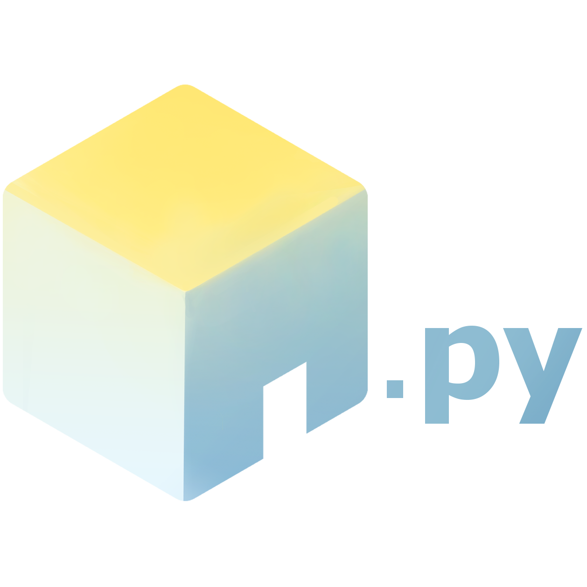

<h1> OpenHiven.py</h1>
<h2>OpenHiven.py is an easy, fast and async API wrapper written in Python that provides extensive 
functionality for the Hiven Swarm and Hiven API. </h2>

!!! Important

    Due to this version still being in development, the following listeners
    are not fully supported (no arguments passed when received):
    
    - `house_join`
    - `house_remove`
    - `house_update`
    - `house_delete`
    - `house_downtime`
    - `room_create`
    - `room_update`
    - `room_delete`
    - `house_member_join`
    - `house_member_leave`
    - `house_member_enter`
    - `house_member_exit`
    - `house_member_update`
    - `house_member_chunk`
    - `batch_house_member_update`
    - `house_entity_update`
    - `relationship_update`
    - `presence_update`
    - `message_create`
    - `message_update`
    - `message_delete`
    - `typing_start`
